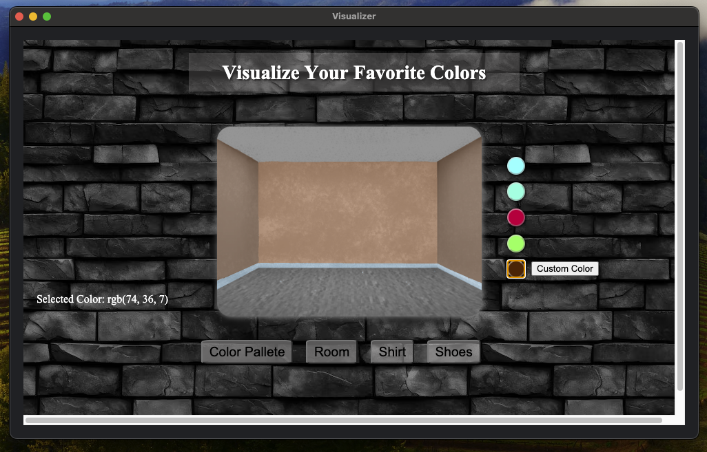

# Color Spectrum Visualization

**Main File**: `main.py`  
This is the core script for visualizing and analyzing color spectra. It includes functionality to handle and display color information, using a streamlined and optimized backend.

## Features

- **Color Spectrum Visualization**: Pick between colors to train an AI Model to create a spectrum of your favorite colors and see them applied in real-world scenarios.
- **Real-World Example Integration**: Visualize how colors would look on walls, outfits, and other objects using HTML/CSS/JavaScript.

## Images





## Goals

- **Code Cleanup**: Removed unused imports and improved code readability with enhanced docstrings and comments.
- **Efficient Data Handling**: Employed list comprehensions and in-place operations to optimize performance.
- **Optimized Training Loop**: Reduced redundancy and improved efficiency in loss calculation and backpropagation.
- **Modularized Code**: Refactored large functions into smaller, more manageable components.
- **Improved Random Choice Handling**: Used `replace=False` to simplify and optimize random choice operations.
- **Exception Handling**: Added exception handling for button interactions to improve user experience and robustness.
- **Enhanced UI Integration**: Incorporated a PyQt5 interface with an integrated button to display HTML visualizations.

## Development

- **HTML/CSS/JavaScript Integration**: Code for web components (HTML, CSS, and JavaScript) is developed in VSCode and integrated into the project. This integration is aimed at showcasing color applications in real-world scenarios.
- **Color Theory Application**: Applied color theory principles with a weighted preference for user-selected colors to enhance visualization accuracy.

## Setup & Usage

1. **Clone the Repository**:
   ```bash
   git clone https://github.com/Mtkurilko/favoriteColor.git